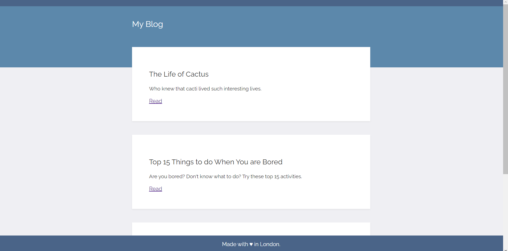
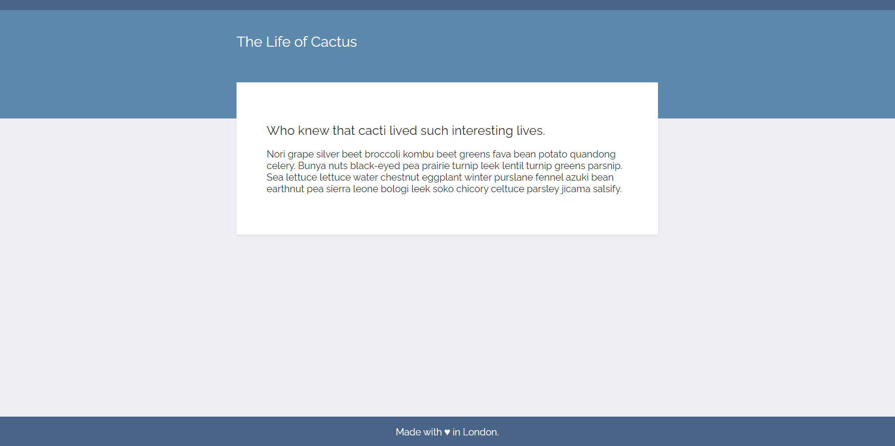

# Flask Blog Web App

A lightweight Flask web application that retrieves and displays blog data from an external API. The project includes two routes: one for showcasing a list of blog entries and another for dynamically generating individual blog posts. It serves as a practical demonstration of Flask fundamentals, API integration, and proper static file linking.




## Getting Started

1. Install dependencies:

   ```bash
   pip install Flask requests

## Project Structure
- **main.py:** Flask application script.
- **static/css/styles.css:** CSS styles for the web app.
- **templates/index.html:** HTML template for displaying the list of blog entries.
- **templates/post.html:** HTML template for individual blog posts.

## Acknowledgments
The website design is prebuilt by Angela Yu and I integrated it into the Flask application.
